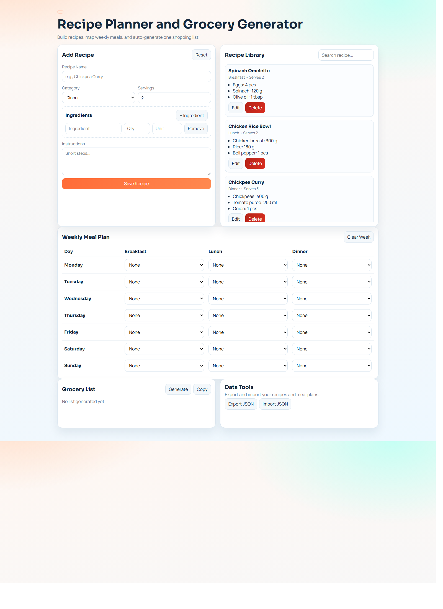

# Recipe Planner JS

A vanilla JavaScript web app to manage recipes, plan meals for the week, and generate a consolidated grocery list.

## Preview



## Features

- Add, edit, search, and delete recipes
- Manage ingredient rows per recipe
- Plan breakfast/lunch/dinner for each day of the week
- Auto-generate grocery totals from planned meals
- Copy grocery list to clipboard
- Export and import app data as JSON
- Persist recipes and meal plans with `localStorage`

## CRUD Coverage

- Create: Add new recipes and ingredients
- Read: Browse recipe library and meal planner state
- Update: Edit existing recipes and adjust meal plan selections
- Delete: Remove recipes and clear weekly meal plan

## Tech Stack

- HTML5
- CSS3
- Vanilla JavaScript (no framework)
- Browser `localStorage` for persistence

## Run Locally

1. Open [index.html](/g:/Fresenius/recipe-planner-js/index.html) directly in a browser, or
2. Start a simple static server from the project folder:

```powershell
python -m http.server 5500
```

Then open `http://localhost:5500`.

## Project Structure

- [index.html](/g:/Fresenius/recipe-planner-js/index.html)
- [styles.css](/g:/Fresenius/recipe-planner-js/styles.css)
- [app.js](/g:/Fresenius/recipe-planner-js/app.js)

## Notes

- All data is stored in the browser under key `recipe_planner_state_v1`.
- Clearing browser storage resets the app data.
